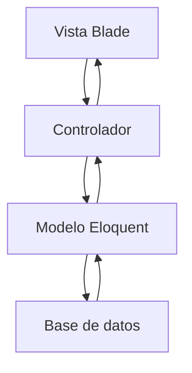

# Sistema de Gestión de Reparaciones de Celulares

---

## Carátula

**Trabajo Práctico Parcial N.° 2:** Sistema de Gestión de Reparaciones de Celulares  
**Profesor:** Calderón Nicolás Ariel  
**Cursada:** Miércoles 19-21 hs  
**Repositorio:** [https://github.com/facusoster/reparaciones](https://github.com/facusoster/reparaciones)

**Alumnos:**

- Julián Verdirame
- Facundo Soster

---

## Índice

- [Sistema de Gestión de Reparaciones de Celulares](#sistema-de-gestión-de-reparaciones-de-celulares)
	- [Carátula](#carátula)
	- [Índice](#índice)
	- [Introducción](#introducción)
	- [Arquitectura del sistema](#arquitectura-del-sistema)
		- [Diagrama de capas](#diagrama-de-capas)
	- [Plan de trabajo y evolución del proyecto](#plan-de-trabajo-y-evolución-del-proyecto)
		- [Iteración 1: Base del sistema](#iteración-1-base-del-sistema)
		- [Iteración 2: Gestión de reparaciones](#iteración-2-gestión-de-reparaciones)
		- [Iteración 3: Validaciones y experiencia de usuario](#iteración-3-validaciones-y-experiencia-de-usuario)
	- [Modelo de dominio](#modelo-de-dominio)
	- [Persistencia de datos](#persistencia-de-datos)
	- [Base de datos](#base-de-datos)
	- [Checklist del parcial](#checklist-del-parcial)
	- [Principios de calidad y buenas prácticas](#principios-de-calidad-y-buenas-prácticas)
		- [Manejo de errores y validaciones](#manejo-de-errores-y-validaciones)
		- [Arquitectura modular](#arquitectura-modular)
		- [Interfaz visual](#interfaz-visual)
	- [Flujo de funcionamiento](#flujo-de-funcionamiento)
	- [Casos de uso](#casos-de-uso)
		- [Ingreso al sistema](#ingreso-al-sistema)
		- [Alta de una reparación](#alta-de-una-reparación)
	- [Funciones principales del CRUD](#funciones-principales-del-crud)
	- [Estado final de entrega](#estado-final-de-entrega)
	- [Conclusión](#conclusión)

---

## Introducción

El presente proyecto consiste en el desarrollo de una aplicación web con Laravel para administrar reparaciones de celulares en un servicio técnico. La aplicación aplica arquitectura MVC, Blade Templates, Eloquent ORM y operaciones CRUD sobre una base de datos relacional.

El objetivo principal es organizar el flujo de trabajo de las reparaciones desde su ingreso hasta su entrega, manteniendo un registro claro de cliente, equipo, falla, fecha y estado. A la vez, el proyecto sirve como práctica integradora de los conceptos vistos en clase, con foco en persistencia, validación y separación de responsabilidades.

---

## Arquitectura del sistema

La aplicación está organizada según una arquitectura MVC. Las rutas definen los puntos de entrada, el controlador coordina la lógica de cada acción, el modelo representa la entidad de dominio y las vistas Blade se encargan de mostrar la información al usuario.

En este proyecto, la entidad central es `Reparacion`, administrada por `ReparacionController` y almacenada en la tabla `reparaciones`. La persistencia se resuelve con Eloquent, mientras que las pantallas principales se encuentran dentro de `resources/views/reparaciones`.

### Diagrama de capas

---

## Plan de trabajo y evolución del proyecto

El desarrollo del sistema se organizó de forma incremental para asegurar que cada parte del flujo quedara estable antes de avanzar a la siguiente. Esa forma de trabajo permite detectar errores más rápido y mantener el código simple.

### Iteración 1: Base del sistema

Se configuró el proyecto Laravel, la conexión con la base de datos y la estructura general de rutas y carpetas. También se definió la entidad principal del sistema, que es la reparación de celulares.

### Iteración 2: Gestión de reparaciones

Se implementó el CRUD principal sobre la tabla `reparaciones`, incluyendo listado, alta, edición, detalle y eliminación. En esta etapa se consolidó el uso de Eloquent y de rutas nombradas.

### Iteración 3: Validaciones y experiencia de usuario

Se agregaron validaciones del lado del servidor para asegurar que los datos obligatorios lleguen completos y con formato válido. También se trabajó la interfaz con Blade y estilos para facilitar la carga y lectura de los registros.

---

## Modelo de dominio

El modelo principal del sistema es `Reparacion`. Representa cada equipo ingresado al servicio técnico y guarda la información necesaria para seguir su estado dentro del proceso de reparación.

Los datos administrados por la entidad son:

- Cliente
- Marca
- Modelo
- Descripción de la falla
- Fecha de ingreso
- Estado

Este modelo se conecta con la tabla `reparaciones` y expone sus campos mediante la propiedad `fillable`, lo que permite crear y actualizar registros de forma segura con Eloquent.

---

## Persistencia de datos

La persistencia se realiza con Eloquent ORM, usando el modelo `Reparacion` como capa de acceso a la tabla correspondiente. Las operaciones de alta, lectura, edición y eliminación se realizan desde el controlador mediante métodos estándar del resource controller.

Las validaciones se aplican antes de guardar o actualizar, evitando que datos incompletos o inválidos lleguen a la base. El formulario de carga también reutiliza la misma estructura de campos en las vistas de crear y editar para mantener coherencia.

---

## Base de datos

El sistema utiliza la tabla `reparaciones`, creada mediante migración. La estructura almacena la información completa de cada reparación y agrega los timestamps de Laravel para registrar cuándo fue creado o modificado cada registro.

Campos principales:

- `id`
- `cliente`
- `marca`
- `modelo`
- `descripcion_falla`
- `fecha_ingreso`
- `estado`
- `created_at`
- `updated_at`

Los estados previstos para la reparación son:

- Ingresado
- En reparación
- Reparado
- Entregado

---

## Checklist del parcial

El proyecto cubre los puntos principales pedidos por la consigna:

- Uso de Laravel.
- Implementación de MVC.
- Persistencia con Eloquent ORM.
- Migración para la tabla `reparaciones`.
- Vistas Blade para el flujo principal.
- Rutas nombradas.
- Validaciones del lado del servidor.
- Interfaz trabajada con CSS propio o Bootstrap.
- Operaciones CRUD completas sobre reparaciones.

---

## Principios de calidad y buenas prácticas

### Manejo de errores y validaciones

La aplicación valida los campos obligatorios antes de persistirlos. También controla que la fecha de ingreso sea válida y que el estado se seleccione desde una lista predefinida.

### Arquitectura modular

La separación entre rutas, controlador, modelo y vistas evita mezclar lógica de negocio con presentación. Esto hace que el proyecto sea más fácil de mantener y extender.

### Interfaz visual

La interfaz se apoya en Blade y estilos personalizados o Bootstrap para mantener una navegación clara, con formularios y listados fáciles de leer.

---

## Flujo de funcionamiento

El usuario ingresa a la aplicación y accede al listado de reparaciones. Desde allí puede registrar una nueva reparación, editar una existente, consultar su detalle o eliminarla según corresponda.

En la carga y modificación de registros, el sistema verifica los datos antes de enviarlos a la base. El objetivo es mantener un historial confiable de cada equipo que ingresa al servicio técnico.

---

## Casos de uso

### Ingreso al sistema

El usuario accede a la pantalla de login definida en la ruta principal. Desde allí se autentica para comenzar a operar sobre el sistema.

### Alta de una reparación

El usuario completa el formulario con los datos del cliente y del equipo. Si la información es válida, el sistema guarda el registro y lo incorpora al listado general.

---

## Funciones principales del CRUD

La aplicación permite crear registros nuevos, listar todas las reparaciones, editar datos existentes, ver el detalle de un caso puntual y eliminar registros cuando sea necesario.

El listado muestra la información más importante para operar rápidamente, mientras que el formulario de edición reutiliza la misma estructura de campos para evitar inconsistencias entre pantallas.

---

## Estado final de entrega

- Aplicación Laravel funcional.
- CRUD de reparaciones implementado.
- Migración de base de datos creada.
- Validaciones del lado del servidor activas.
- Vistas Blade separadas por responsabilidad.
- Estructura lista para defensa del parcial.

## Conclusión

El sistema resume una solución simple y clara para administrar reparaciones de celulares con Laravel. La estructura elegida permite cumplir la consigna y, al mismo tiempo, deja el proyecto ordenado para agregar mejoras futuras sin rehacer la base del trabajo.

La combinación de MVC, Eloquent, Blade, migraciones y validaciones del lado del servidor forma una base sólida para presentar el parcial y explicar el funcionamiento del sistema con una lógica bien separada.
