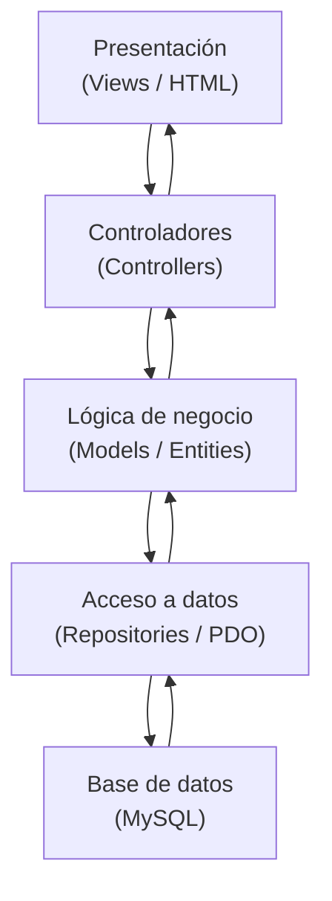

# Sistema de Gestión para Agencia de Autos

---

## Carátula

**Universidad:** Escuela DaVinci  
**Materia:** Producción Web  
**Profesor:** Calderón Nicolás Ariel  
**Alumno:** Soster Facundo Nahuel  
**Trabajo Práctico Parcial:** Sistema de Gestión para Agencia de Autos

---

## Índice

- [Sistema de Gestión para Agencia de Autos](#sistema-de-gestión-para-agencia-de-autos)
  - [Carátula](#carátula)
  - [Índice](#índice)
  - [Introducción](#introducción)
  - [Arquitectura del sistema](#arquitectura-del-sistema)
    - [Diagrama de capas](#diagrama-de-capas)
  - [Plan de trabajo y evolución del proyecto](#plan-de-trabajo-y-evolución-del-proyecto)
    - [Iteración 1: Base del sistema](#iteración-1-base-del-sistema)
    - [Iteración 2: Gestión de vehículos](#iteración-2-gestión-de-vehículos)
    - [Iteración 3: Gestión de archivos y estado](#iteración-3-gestión-de-archivos-y-estado)
    - [Iteración 4: Mejoras de navegación y visualización](#iteración-4-mejoras-de-navegación-y-visualización)
    - [Iteración 5: Exportación y análisis](#iteración-5-exportación-y-análisis)
  - [Modelo de dominio](#modelo-de-dominio)
  - [Persistencia de datos](#persistencia-de-datos)
  - [Base de datos](#base-de-datos)
  - [Checklist del parcial](#checklist-del-parcial)
  - [Principios de calidad y buenas prácticas](#principios-de-calidad-y-buenas-prácticas)
    - [Manejo de errores y excepciones](#manejo-de-errores-y-excepciones)
    - [Seguridad y control de acceso](#seguridad-y-control-de-acceso)
    - [Comunicación clara](#comunicación-clara)
    - [Arquitectura modular](#arquitectura-modular)
    - [Interfaz visual](#interfaz-visual)
  - [Flujo de funcionamiento](#flujo-de-funcionamiento)
  - [Casos de uso](#casos-de-uso)
    - [Ingreso de un empleado](#ingreso-de-un-empleado)
    - [Alta de un vehículo por un administrador](#alta-de-un-vehículo-por-un-administrador)
  - [Funciones principales del CRUD](#funciones-principales-del-crud)
  - [Estado final de entrega](#estado-final-de-entrega)
  - [FAQ App](#faq-app)
    - [¿Cómo ingreso al sistema?](#cómo-ingreso-al-sistema)
    - [¿Qué puede hacer un empleado?](#qué-puede-hacer-un-empleado)
    - [¿Qué puede hacer un administrador?](#qué-puede-hacer-un-administrador)
    - [¿La imagen del vehículo es obligatoria?](#la-imagen-del-vehículo-es-obligatoria)
    - [¿Qué validaciones tiene la imagen?](#qué-validaciones-tiene-la-imagen)
    - [¿Qué pasa con un vehículo vendido?](#qué-pasa-con-un-vehículo-vendido)
    - [¿Qué columnas exporta el CSV?](#qué-columnas-exporta-el-csv)
    - [¿Dónde está el script de base de datos?](#dónde-está-el-script-de-base-de-datos)
  - [Conclusión](#conclusión)

---

## Introducción

El presente proyecto consiste en el desarrollo de una aplicación web orientada a la gestión de una agencia de autos, implementada en PHP utilizando Programación Orientada a Objetos y acceso a datos mediante PDO. El sistema permite la autenticación de usuarios, la diferenciación de roles y la administración completa de vehículos mediante operaciones CRUD, manteniendo una separación clara entre lógica de negocio, acceso a datos y presentación.

El objetivo principal es aplicar conceptos fundamentales de desarrollo backend, priorizando la organización del código, la seguridad en el manejo de datos y la escalabilidad de la aplicación. A lo largo del trabajo se implementaron mecanismos de validación, control de permisos, mensajes flash, manejo de errores y una interfaz visual uniforme para que el sistema pueda ser entendido, mantenido y ampliado con facilidad.

> **Nota:** en el código las clases se llaman `User` y `Vehicle`, aunque en la consigna se mencionan como `Usuario` y `Vehiculo`. La terminología cambia, pero la intención del modelo es la misma.

---

## Arquitectura del sistema

La aplicación está estructurada siguiendo una separación de responsabilidades que divide el sistema en capas bien definidas. Los controladores reciben las solicitudes del usuario y coordinan las acciones del sistema; los repositorios gestionan la interacción con la base de datos encapsulando las consultas SQL; y las vistas se encargan de la presentación de la información al usuario. Esta organización evita la mezcla de lógica de negocio con HTML o consultas SQL, lo que facilita el mantenimiento y la evolución del sistema.

La estructura de carpetas refleja esta separación. En `App/core/` se encuentran utilidades transversales como autenticación, flash messages, logger y el controlador base. En `App/src/Models/` están las clases de dominio. En `App/src/Repositories/` se concentra la persistencia. En `App/src/Controllers/` se resuelven los flujos de cada módulo. Finalmente, en `App/src/Views/` se ubica la presentación compartida y las pantallas específicas.

Esta arquitectura permite que cada componente cumpla una sola responsabilidad. El resultado es una base de código más legible, más fácil de depurar y menos propensa a generar dependencias innecesarias entre capas.

> **Nota:** cuando una aplicación crece, esta separación evita que el proyecto termine convertido en archivos largos donde el HTML, el SQL y la lógica de negocio quedan mezclados.

### Diagrama de capas

El siguiente esquema resume el recorrido principal de la aplicación desde la interfaz hasta la base de datos.



> **Nota:** el diagrama representa el flujo principal de una petición. El usuario interactúa con la vista, el controlador coordina la acción, el modelo resuelve la lógica y el repositorio llega a la base de datos.

---

## Plan de trabajo y evolución del proyecto

El desarrollo del sistema se organizó siguiendo un enfoque incremental, donde cada iteración incorpora funcionalidades nuevas sobre una base previamente estable y validada. Este enfoque permite evitar la implementación monolítica, facilitando la detección temprana de errores, la mejora continua de la arquitectura y una evolución controlada del proyecto.

Al estructurar el trabajo de esta manera se logran varios objetivos pedagógicos: cada iteración se puede analizar de forma independiente, las decisiones de diseño se justifican en contexto y el resultado final es un proyecto que refleja evolución natural, no una solución armada de cero.

### Iteración 1: Base del sistema

Se estableció la estructura general del proyecto, la configuración de PDO y el modelo de dominio inicial (`User`, `Vehicle`). En esta etapa se implementó el sistema de autenticación con manejo de sesiones y roles, ya que constituye la base para el control de acceso del resto del sistema. Las decisiones tomadas aquí (clase abstracta `User`, interface `Authenticable`, encapsulamiento en `Vehicle`) sentaron los pilares conceptuales que permitieron agregar funcionalidades posteriores sin reestructuración mayor.

### Iteración 2: Gestión de vehículos

Se desarrolló el CRUD completo de vehículos, incorporando validaciones de negocio y persistencia mediante repositorios. Esta etapa se construyó sobre la autenticación ya resuelta, permitiendo aplicar control de permisos en las operaciones. El enfoque de repositorio encapsuló las consultas SQL y permitió escalar el acceso a datos sin afectar la lógica de negocio.

### Iteración 3: Gestión de archivos y estado

Se agregó la funcionalidad de carga de imágenes con validaciones de formato y tamaño, junto con la generación de nombres únicos y almacenamiento seguro. Además, se incorporó el estado comercial del vehículo (`disponible` / `vendido`), integrándolo en el modelo de dominio y en las reglas del sistema. Esta iteración demostró cómo una nueva dimensión comercial requiere ajustes en múltiples capas sin quebrantar la arquitectura existente.

### Iteración 4: Mejoras de navegación y visualización

Se implementaron funcionalidades de búsqueda, ordenamiento y paginación, mejorando significativamente la experiencia de usuario en listados extensos. También se desarrolló una vista tipo dashboard con tarjetas de vehículos disponibles, reutilizando lógica de filtrado y navegación. En esta iteración se vio cómo la reutilización de componentes y parámetros de navegación mantiene coherencia funcional a medida que la interfaz se complejiza.

### Iteración 5: Exportación y análisis

Se incorporó la exportación de datos en formato CSV, respetando los filtros activos y restringida a usuarios administradores. Esta funcionalidad permite la integración con herramientas externas de análisis como Excel o Power BI. La iteración puso de relieve cómo una nueva modalidad de acceso a datos se puede agregar respetando las capas existentes y manteniendo el control de permisos.

Este esquema de trabajo permitió construir el sistema de manera progresiva, validando cada funcionalidad antes de avanzar y asegurando que cada nueva característica se integrara de manera coherente con las anteriores.

Es importante notar que los principios de calidad descritos en la siguiente sección se aplicaron de forma transversal durante todas estas iteraciones, no como un paso final sino como parte integral de la construcción.

---

## Modelo de dominio

El diseño del sistema se basa en los principios de la Programación Orientada a Objetos. La jerarquía de usuarios está representada por una clase base abstracta y dos especializaciones concretas: `Employee` y `Administrator`. Esa estructura permite compartir comportamiento común y, al mismo tiempo, establecer diferencias de permisos y responsabilidades según el rol.

```php
interface Authenticable {
    public function login(string $email, string $password): bool;
    public function logout(): void;
}

abstract class User implements Authenticable {
    protected ?int $id = null;
    protected string $name;
    protected string $email;
    protected ?string $password = null;
}

class Employee extends User {
    public function getRole(): string { return 'employee'; }
}

class Administrator extends User {
    public function getRole(): string { return 'admin'; }
}
```

La interface `Authenticable` funciona como contrato, ya que obliga a implementar métodos de autenticación. La clase abstracta `User`, en cambio, centraliza atributos y comportamientos compartidos. Sobre esa base se derivan los roles concretos que utiliza el sistema en sus reglas de acceso.

En el caso de los vehículos, se modela una entidad con encapsulamiento completo. La clase `Vehicle` concentra atributos como tipo, marca, modelo, año y precio, y los protege mediante getters y setters. Además, incorpora una clase abstracta auxiliar y un contador estático para reforzar los conceptos pedidos en la consigna.

```php
abstract class Manageable {
    abstract public function save(): bool;
}

class Vehicle extends Manageable {
    private ?int $id = null;
    private ?string $type = null;
    private ?string $brand = null;
    private ?string $model = null;
    private ?int $year = null;
    private ?float $price = null;
    private ?string $imageName = null;
    private string $status = 'disponible';

    private static int $totalInstances = 0;
}
```

> **Nota:** el uso de propiedades privadas obliga a acceder a los datos mediante métodos. Eso evita que una parte de la aplicación modifique un valor de forma directa sin pasar por validaciones.

También se aplica encapsulamiento en los setters, especialmente en campos sensibles como el precio.

```php
public function setPrice(float $price): void {
    if ($price < 0) {
        throw new InvalidArgumentException('Precio inválido');
    }
    $this->price = $price;
}
```

Este enfoque protege el objeto y evita estados incoherentes dentro del sistema.

---

## Persistencia de datos

La comunicación con la base de datos se realiza mediante PDO, lo que permite trabajar con sentencias preparadas y manejar errores de forma controlada. Esta decisión mejora la seguridad del sistema porque evita la concatenación directa de datos en consultas SQL y reduce el riesgo de inyección SQL.

El repositorio de usuarios y el repositorio de vehículos encapsulan las consultas más importantes. Por ejemplo, el login consulta por email y luego delega la validación de la contraseña al mecanismo seguro de `password_verify()`.

```php
$stmt = $pdo->prepare('SELECT * FROM users WHERE email = :email LIMIT 1');
$stmt->execute([':email' => $email]);
```

Una vez recuperado el registro, la sesión se arma únicamente si la contraseña coincide.

```php
$hashed = $user->getHashedPassword();
if ($hashed === null || !password_verify($password, $hashed)) {
    Flash::error('Credenciales incorrectas.');
    header('Location: login.php');
    exit;
}

$_SESSION['user_id'] = $user->getId();
$_SESSION['user_name'] = $user->getName();
$_SESSION['role'] = $user->getRole();
```

> **Nota:** la contraseña nunca se compara en texto plano. Primero se almacena con hash y después se valida con `password_verify()`.

Las operaciones de alta, modificación y eliminación de vehículos también se ejecutan con consultas preparadas. De este modo, los datos ingresados por formulario no se mezclan con la sentencia SQL y el acceso a datos queda controlado por una capa específica.

Desde la Iteración 2, el módulo de vehículos incorpora subida de imágenes con validación de formato y tamaño, generación de nombre único, persistencia del nombre de archivo y política de fallback a una imagen por defecto cuando el usuario no carga foto.

```php
$maxBytes = 2 * 1024 * 1024;
$allowedExtensions = ['jpg', 'jpeg', 'png'];
$allowedMimeTypes = ['image/jpeg', 'image/png'];
```

En la Iteración 3 se agregó el manejo de estado comercial del vehículo (`disponible` o `vendido`) en la capa de dominio, en el repositorio y en los formularios de alta/edición. Este estado también se expone en el listado con badge visual y participa en los filtros para navegación y dashboard.

En la Iteración 4 se incorporó en dashboard un bloque de tarjetas de vehículos en venta (disponibles), con foto, modelo, precio, estado, descripción breve y paginación. Este bloque reutiliza los mismos parámetros de navegación del módulo de vehículos (`q`, `sort`, `dir`, `page`, `perPage`) para mantener coherencia funcional.

En la Iteración 5 se incorporó la exportación CSV de vehículos para análisis en BI, restringida al rol administrador. La exportación respeta filtros activos del listado (`q`, `status`, `sort`, `dir`) y genera un archivo en codificación UTF-8 con cabeceras estandarizadas para consumo en Excel y Power BI.

---

## Base de datos

El sistema utiliza una base de datos denominada `concesionario`, cuyo archivo de carga se encuentra en [App/database/concesionario.sql](database/concesionario.sql). Ese archivo contiene la estructura completa de la base junto con datos de prueba para usuarios y vehículos.

La base está compuesta principalmente por dos tablas. La tabla `users` almacena la información de los usuarios del sistema, incluyendo nombre, correo electrónico, contraseña encriptada y rol. El rol permite distinguir entre empleados y administradores, lo que impacta directamente en los permisos dentro de la aplicación. La tabla `vehicles` contiene la información de los vehículos disponibles en la agencia, con campos para tipo, marca, modelo, año, precio y fecha de creación.

```sql
CREATE TABLE `users` (
  `id` int(10) UNSIGNED NOT NULL,
  `name` varchar(100) NOT NULL,
  `email` varchar(150) NOT NULL,
  `password` varchar(255) NOT NULL,
  `role` enum('employee','admin') NOT NULL DEFAULT 'employee',
  `created_at` timestamp NOT NULL DEFAULT current_timestamp()
);
```

```sql
CREATE TABLE `vehicles` (
  `id` int(10) UNSIGNED NOT NULL,
  `type` varchar(50) DEFAULT NULL,
  `brand` varchar(100) NOT NULL,
  `model` varchar(100) NOT NULL,
  `year` smallint(5) UNSIGNED DEFAULT NULL,
  `price` decimal(10,2) NOT NULL DEFAULT 0.00,
    `image_name` varchar(255) DEFAULT NULL,
    `status` enum('disponible','vendido') NOT NULL DEFAULT 'disponible',
  `created_at` timestamp NOT NULL DEFAULT current_timestamp()
);
```

Las claves primarias de ambas tablas utilizan `AUTO_INCREMENT`, lo que simplifica la inserción de registros nuevos. Además, el campo `email` en `users` se mantiene único para evitar duplicados en la autenticación.

La relación entre ambas tablas no es directa, pero el sistema utiliza la información de `users` para controlar quién puede realizar determinadas acciones sobre los vehículos. Esa decisión responde a la lógica de permisos, no a una asociación de datos entre entidades.

---

## Checklist del parcial

El parcial se encuentra cubierto en sus puntos principales. La clase `Vehicle` resuelve la representación de los vehículos con propiedades privadas y métodos de acceso. La jerarquía `User` → `Employee` y `User` → `Administrator` implementa la herencia requerida. La interface `Authenticable` y la clase abstracta `Manageable` cubren la exigencia de usar al menos una abstracción formal. También se incorporaron miembros estáticos, login con sesiones, validación con `password_verify()`, CRUD de vehículos con PDO y tabla HTML para los listados.

El acceso a la gestión de usuarios está restringido exclusivamente a administradores mediante el helper `Auth::requireAdmin()`. Esa decisión evita exponer funcionalidades de administración a perfiles sin permisos. En paralelo, el sistema presenta los vehículos en una tabla HTML con acciones de edición y eliminación, lo que completa la parte visible del CRUD.

```php
Auth::requireAdmin();
```

```php
<table class="table table-striped table-hover align-middle">
```

> **Nota:** el cumplimiento no depende solo de que existan los archivos, sino de que el flujo completo funcione de manera coherente entre login, permisos, persistencia y vistas.

---

## Principios de calidad y buenas prácticas

Más allá de las funcionalidades específicas de cada iteración, el proyecto aplicó un conjunto de prácticas transversales que mejoran la calidad, mantenibilidad y robustez del código. Estos principios se implementaron de forma consistente a lo largo del desarrollo y facilitan que la aplicación pueda escalar y adaptarse sin degradación.

### Manejo de errores y excepciones

Se definieron excepciones personalizadas por dominio y se agregaron bloques `try/catch/finally` en operaciones críticas. Además, la aplicación implementa un manejador global de errores que unifica la respuesta ante fallos, evitando exponer detalles técnicos al usuario y registrando información relevante para auditoría.

```php
try {
    // operación crítica
} catch (ValidationException $e) {
    Flash::error($e->getMessage());
} finally {
    // punto de extensión para trazabilidad adicional
}
```

```php
set_error_handler([self::class, 'handleError']);
set_exception_handler([self::class, 'handleException']);
```

### Seguridad y control de acceso

El control de permisos está centralizado mediante métodos como `Auth::requireAdmin()`, asegurando que cada rol tenga acceso solo a las funcionalidades que le corresponden. Las contraseñas se almacenan con hash y se validan con `password_verify()`, nunca en texto plano. Las consultas SQL utilizan sentencias preparadas vía PDO para prevenir inyección de código.

### Comunicación clara

El sistema unificó los mensajes de usuario mediante flash messages, permitiendo que el resultado de operaciones (éxito, error, validación) se comunique de forma consistente en la interfaz sin necesidad de lógica condicional dispersa en las vistas.

### Arquitectura modular

El layout compartido (header, navegación, footer) evita repetición de código y facilita cambios globales. Cada componente de presentación se mantiene en una vista independiente, lo que simplifica el mantenimiento y permite evolucionar la interfaz sin afectar la lógica de negocio.

### Interfaz visual

La aplicación utiliza Bootstrap para garantizar consistencia visual, accesibilidad y responsividad. Este estándar de facto en desarrollo web permite que cualquier persona que entienda Bootstrap pueda navegar el código CSS sin sorpresas.


---

## Flujo de funcionamiento

El funcionamiento del sistema comienza cuando el usuario accede al formulario de login e ingresa sus credenciales. El proceso de autenticación consulta la base de datos, recupera el usuario correspondiente y valida la contraseña de manera segura. Si el ingreso es correcto, se crea la sesión y se almacenan los datos necesarios para identificar al usuario durante la navegación.

Una vez autenticado, el usuario puede acceder a distintas funcionalidades según su rol. Los administradores tienen acceso completo, incluyendo la gestión de usuarios, mientras que los empleados cuentan con permisos más limitados. Las acciones sobre los vehículos, como creación, modificación o eliminación, pasan por un proceso de validación antes de ser persistidas en la base de datos.

En el alta y edición de vehículos, la imagen es opcional. Si el archivo excede 2MB o no cumple el formato (`jpg`, `jpeg`, `png`), el sistema muestra un mensaje de validación claro al usuario. Si no se sube imagen, la interfaz utiliza un recurso por defecto para mantener consistencia visual.

Además, el estado comercial se captura desde formulario y se refleja en las grillas. Para preservar historial, los vehículos vendidos no se eliminan desde la interfaz de gestión, de modo que la información histórica se conserve para análisis posterior.

El dashboard ahora presenta tarjetas de vehículos en venta con filtros y ordenamiento consistentes con el listado principal. Esto permite explorar oportunidades comerciales desde el panel sin perder contexto de búsqueda y navegación.

El sistema mantiene el estado de navegación mediante parámetros de búsqueda, orden y paginación. Esto permite que los listados extensos puedan recorrerse sin perder el contexto de filtros aplicados ni el orden seleccionado por el usuario.

> **Nota:** conservar el estado de navegación evita que cada cambio de página obligue a rehacer la búsqueda o el ordenamiento desde cero.

---

## Casos de uso

### Ingreso de un empleado

Un empleado accede al sistema escribiendo su email y su contraseña. El formulario envía los datos al procesador de login, que verifica la existencia del usuario en la base de datos y compara la contraseña con el hash almacenado. Si la validación es correcta, la aplicación crea la sesión y redirige al panel principal.

### Alta de un vehículo por un administrador

Un administrador carga un nuevo vehículo desde el formulario correspondiente. El sistema valida que los campos obligatorios estén completos, confirma que el año y el precio sean válidos y, de forma adicional, valida la imagen si se adjunta (máximo 2MB y formatos permitidos). Luego construye el objeto `Vehicle`, guarda el nombre de archivo en base de datos y persiste el registro mediante el repositorio. Finalmente muestra un mensaje de confirmación y vuelve al listado paginado.

---

## Funciones principales del CRUD

La operación de crear recibe los datos del formulario, los valida y ejecuta un `INSERT` sobre la tabla correspondiente. La operación de lectura muestra listados, búsquedas y filtros con ordenamiento y paginación. La actualización localiza el registro por ID, valida los cambios y ejecuta un `UPDATE`. La eliminación verifica permisos y confirma la acción antes de ejecutar el `DELETE`.

En el módulo de vehículos, el CRUD ahora contempla el ciclo completo de imágenes: durante la creación o edición se procesa el archivo, se genera un nombre único y se guarda en carpeta pública; cuando se reemplaza una imagen se elimina la anterior del servidor; y al eliminar un vehículo también se elimina su archivo asociado.

Con la Iteración 3, el CRUD incorpora reglas de estado: los registros vendidos permanecen en el sistema para mantener trazabilidad histórica y se prioriza su edición/consulta sobre su eliminación física.

En Iteración 4, la lectura se amplía con una vista de tarjetas paginada para vehículos disponibles, orientada a consulta rápida desde dashboard y pensada para futuras integraciones visuales de negocio.

En Iteración 5, la lectura/exportación incorpora un endpoint dedicado de descarga CSV con columnas acordadas: `Id`, `Tipo`, `Marca`, `Modelo`, `Año`, `Precio`, `Estado`. Este flujo preserva filtros actuales y mantiene control de permisos para evitar exportaciones por usuarios no autorizados.

En vehículos, el sistema además conserva el contexto de búsqueda, orden y página actual, de modo que una modificación o un cambio de navegación no rompa la experiencia del usuario. Esa decisión resulta importante cuando la cantidad de registros crece y el listado empieza a requerir más control visual.

```php
$page = max(1, (int)($_GET['page'] ?? 1));
$perPage = max(1, min(25, (int)($_GET['perPage'] ?? 10)));
```

> **Nota:** el CRUD no se limita a “guardar y borrar”. También implica controlar qué ve cada rol, cómo se ordenan los datos y cómo se recupera el estado entre navegaciones.

---

## Estado final de entrega

- Login con roles (`employee` y `admin`) funcionando con control de permisos.
- CRUD de vehículos operativo con validaciones de negocio.
- Carga de imágenes implementada (opcional), con validación de formato/peso y fallback por defecto.
- Manejo de estado comercial (`disponible` / `vendido`) con badges, filtros y conservación de historial.
- Dashboard con tarjetas de vehículos en venta, búsqueda, ordenamiento y paginación.
- Exportación CSV para BI con filtros activos y permisos restringidos a administradores.
- Documentación técnica actualizada por iteración.

> **Nota para demo:** las imágenes de `uploads/vehicles` pueden recargarse antes de la grabación del video explicativo para mostrar un escenario limpio y consistente.

---

<!-- FAQ:START -->
## FAQ App

### ¿Cómo ingreso al sistema?

Desde `login.php` con email y contraseña. El sistema valida credenciales con `password_verify()` y habilita permisos según rol (`employee` o `admin`).

### ¿Qué puede hacer un empleado?

- Ver dashboard.
- Consultar vehículos.
- Buscar, ordenar y paginar listados.

No puede gestionar usuarios ni exportar CSV.

### ¿Qué puede hacer un administrador?

Además de lo anterior:

- Gestionar usuarios.
- Crear, editar y eliminar vehículos disponibles.
- Exportar CSV con filtros activos.

### ¿La imagen del vehículo es obligatoria?

No. Si no se carga una imagen, el sistema usa una imagen por defecto.

### ¿Qué validaciones tiene la imagen?

- Tamaño máximo: 2MB.
- Formatos permitidos: `jpg`, `jpeg`, `png`.

### ¿Qué pasa con un vehículo vendido?

Se conserva para historial. Puede consultarse y filtrarse, pero no se elimina desde la gestión estándar.

### ¿Qué columnas exporta el CSV?

`Id`, `Tipo`, `Marca`, `Modelo`, `Año`, `Precio`, `Estado`.

### ¿Dónde está el script de base de datos?

En `App/database/concesionario.sql`.
<!-- FAQ:END -->

---

## Conclusión

El sistema desarrollado cumple con los requisitos planteados, integrando conceptos fundamentales de Programación Orientada a Objetos, manejo seguro de datos y organización de una aplicación web. La estructura adoptada permite que el proyecto sea mantenible y escalable, facilitando la incorporación de nuevas funcionalidades sin necesidad de reestructurar la base existente.

Este trabajo no solo demuestra la implementación técnica de los conceptos vistos en la materia, sino también la capacidad de diseñar una solución coherente, organizada y preparada para crecer. La combinación de herencia, abstracción, encapsulamiento, persistencia segura y una interfaz uniforme produce una base sólida para defender el parcial y continuar ampliando el proyecto.

> **Advertencia:** los ejemplos de código incluidos en esta documentación resumen la idea general. Para revisar la implementación completa conviene consultar el código del proyecto junto con el dump de base de datos ubicado en [App/database/concesionario.sql](database/concesionario.sql).
